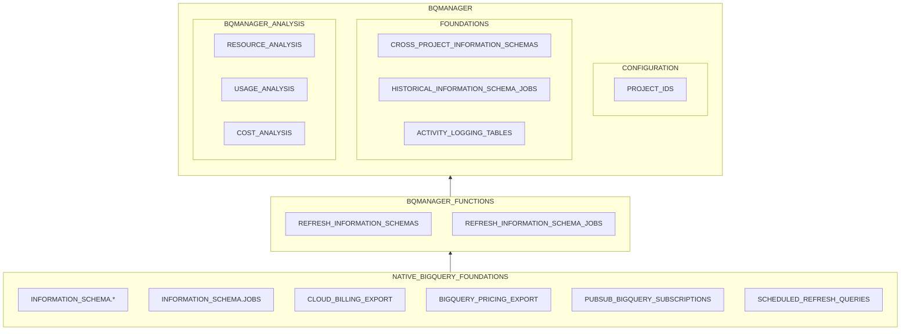

## Overview
The standard BigQuery Manager (`BQMANAGER`) deployment is build entirely from native BigQuery resources, functions and components, with no external dependencies or APIs.  

## Native BigQuery Foundations

`BQMANAGER` is built on the following native BigQuery foundations, extending them to enable an accessible, extensible, integrated cross-project view of resource, usage and cost metadata. 

BigQuery Foundation | Usage Description 
--- | --- 
[INFORMATION_SCHEMA.*]((https://cloud.google.com/bigquery/docs/information-schema-intro)) | Resource metadata views 
[INFORMATION_SCHEMA.JOBS](https://cloud.google.com/bigquery/docs/information-schema-jobs) |  BigQuery activity logging
[CLOUD_BILLING_EXPORT](https://cloud.google.com/billing/docs/how-to/export-data-bigquery) | Google Cloud Billing analysis 
[PUBSUB_BIGQUERY_SUBSCRIPTIONS](https://cloud.google.com/pubsub/docs/bigquery) | Scheduled query monitoring
[BIGQUERY_PRICING_EXPORT](https://cloud.google.com/bigquery/pricing) | Activity-based cost analysis & scenario modelling

## BQMANAGER Components

### Configuration
BQMANAGER Resource | Type |Description 
--- | --- | ---
`BQMANAGER.PROJECT_IDS` | `SQL UDF` | An `ARRAY<STRING>` of in-scope `project_ids` passed as arguments to the `BQMANAGER.REFRESH_*` functions.

### Functions
These procedures are required to refresh the `BQMANAGER` foundation tables, which use a variety of implementation strategies depending on the source structure and limitations.  However, conceptually they are either `FULL REFRESH` tables for the majority or an `INCREMENTAL` table for the `INFORMATION_SCHEMA.JOBS` table.

BQMMANAGER Function | Description 
--- | --- 
`BQMANAGER.REFRESH_INFORMATION_SCHEMAS` | Recreates the full `INFORMATION_SCHEMA_*` tables for in-scope projects
`BQMANAGER.REFRESH_INFORMATION_SCHEMA_JOBS` | Overwrites the previous `n` date partitions of the `INFORMATION_SCHEMA.JOBS` logs across all in-scope projects.

These are deployed into the local `BQMANAGER` dataset and call a set of procedures in the `bqmanager.[region]` datasets depending on the deployed region.  These granular refresh functions are only permitted to licensed `BQMANAGER` users.

Note that by default the `INFORMATION_SCHEMA.JOBS` logs in BigQuery are automatically deleted after 180 days, making analysis beyond this point impossible, and the expiration period cannot be changed. BigQuery Manager enables permanent preservation of these logs for historic, granular analysis and year-on-year comparisons.  

### Foundation Tables
In order to enable cross-project analysis, these BigQuery foundations are used to build a set of foundational BigQuery Manager source tables in your local `BQMANAGER` dataset.  Schemas for these foundational tables are precisely aligned to the BigQuery schemas for each data source.

BQMMANAGER Foundation Table | Type | Description 
--- | --- | ---
`INFORMATION_SCHEMA_COLUMNS`| `FULL REFRESH` | Cross-project [INFORMATION_SCHEMA.COLUMNS](https://cloud.google.com/bigquery/docs/information-schema-columns)
`INFORMATION_SCHEMA_JOBS` | `INCREMENTAL` | Cross-project, historic [INFORMATION_SCHEMA.JOBS](https://cloud.google.com/bigquery/docs/information-schema-jobs)
`INFORMATION_SCHEMA_PARTITIONS` | `FULL REFRESH` | Cross-project [INFORMATION_SCHEMA.PARTITIONS]()
`INFORMATION_SCHEMA_TABLES` | `FULL REFRESH` | Cross-project [INFORMATION_SCHEMA.TABLES](https://cloud.google.com/bigquery/docs/information-schema-tables)
`INFORMATION_SCHEMA_TABLES_METADATA` | `FULL REFRESH` | Cross-project [dataset].\_\_TABLES\_\_ 
`INFORMATION_SCHEMA_TABLE_OPTIONS` | `FULL REFRESH` | Cross-project [INFORMATION_SCHEMA.TABLE_OPTIONS](https://cloud.google.com/bigquery/docs/information-schema-table-options)
`INFORMATION_SCHEMA_TABLE_STORAGE` | `FULL REFRESH` | Cross-project [INFORMATION_SCHEMA.TABLE_STORAGE](https://cloud.google.com/bigquery/docs/information-schema-table-storage)
`INFORMATION_SCHEMA_VIEWS` | `FULL REFRESH` | Cross-project [INFORMATION_SCHEMA.VIEWS](https://cloud.google.com/bigquery/docs/information-schema-table-options)
`SCHEDULED_QUERY_LOGS` | `LOGGING` | Cross-project raw [Scheduled Query](https://cloud.google.com/bigquery/docs/scheduling-queries) logs

These foundation tables are then used to build a specific and growing set of analytic tables, and can also be used as the foundation for custom analysis depending on your specific objectives.  

### Analytic Resources
This set of core analytic resources is growing and will continue to grow over time as additional generalised use-cases are identified via client implementations.

BQMMANAGER Analytic Resource | Type | Parameters | Description 
--- | --- | --- | ---
`BQMAANAGER.TABLES` | `VIEW` | `None` | Integrated `TABLES` foundation view for all `TABLE` resources (`BASE TABLES`, `EXTERNAL TABLES`, `PARTITIONED TABLES`, `SHARDED TABLES`)
`BQMANAGER.GET_SCHEDULED_QUERY_LOGS` | `TABLE FUNCTION` | `None` | Scheduled query logs with decoded payload and metadata
`BQMANAGER.GET_TABLE_USAGE` | `TABLE FUNCTION` | `start_date DATE, end_date DATE`| Date-bounded referenced and destination logs aggregated by `table_id`
`BQMANAGER.GET_TABLE_STATUS` | `TABLE FUNCTION` | `start_date DATE, end_date DATE`| Aggregated table metadata, date-bounded usage and usage status

### Analysis Templates
A set of Looker Studio templates are also available based on the core analysis tables.  These are replicated to client-specific data sources using our BigQuery implementation of the [Looker Studio Linking API](https://developers.google.com/looker-studio/integrate/linking-api).

## Deployment
We can deploy the standard `BQMANAGER` capabilities to any `us` or `eu` located dataset, which can then be used on any number of projects in that region.  We have a standard consulting enagement through which we deploy all of the resources, and then an ongoing licence to enable refresh of the `BQMANAGER` foundation tables. Note that there are often complex permissions challenges to navigate and resolve as part of this process. We can also deploy `BQMANAGER` to different geographic locations upon request.

Please contact [`bqmanager@transformationflow.io`](mailto:bqmanager@transformationflow.io?subject=BigQuery%20Manager%20Enquiry) for further information. We also offer bespoke consulting services based on this library and specific desired analytical outcomes.
