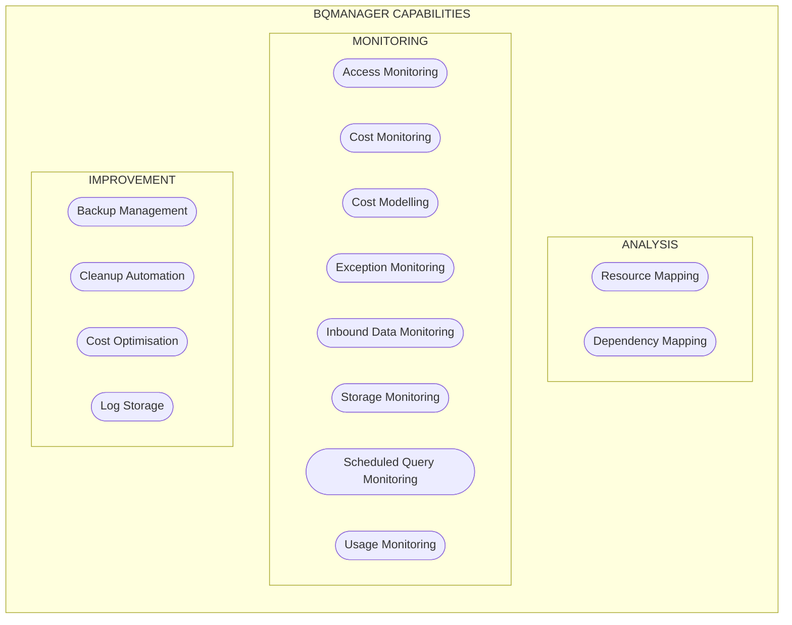

BigQuery Manager has been developed with three core guiding principles: **Visibility**, **Simplicity** and **Efficiency**.  These can also be considered as three stages of implementation and therefore corresponding levels of maturity.

## Visibility 
The first step is to map out the resources (tables, views, routines), activity and costs relating to each resource or set/type of resources.  This is the foundational knowledge upon which subsequent activities are based.  This resource metadata can then be augmented with real-time usage data to give a clear view of all resources and usage across multiple projects and organisations. This stage powers data capture for granular historical reporting and modelling, as well as the future monitoring strategy.

A more advanced analysis can also include connections between the resources and granular permissions to ensure all data is secured appropriately.

## Simplicity
Any Data Warehouse tends towards chaos without conscious effort to the contrary. The first step in bringing order to the warehouse is simplification: identifying defunct resources, backing them up and deleting them is a good starting point. Standardisation of naming conventions and simplification of logical relationships and permissions is a subsequent, more complex stage to improve the structure of the data warehouse and the logic flowing through it.

## Effiency
Date Warehouse performance and efficiency improvements result in faster speed _and_ reduced cost, which is desirable in all situations.  Improvements in visibility and simplicity will support these lower costs and increased performance, supporting targeted action as well as cost optimisation by modelling the impact of different pricing models on actual usage data.

# Capabilities
These objectives are achieved via the following capabilities, enabled by the architecture outlined in the [BigQuery Manager Architecture](http://transformationflow.io/bqmanager/architecture/) section.

Note that `Dependency Mapping` and notifications attached to all `Monitoring` capabilities are advanced features and require access to external APIs ([`SQLGlot`](https://github.com/tobymao/sqlglot) and [`Slack`](https://github.com/slackapi/python-slack-sdk) respectively, deployed as BigQuery Remote Functions), in addition to usage of complex [recursive queries](https://cloud.google.com/bigquery/docs/recursive-ctes) to traverse the derived dependency tree.

# Deployment
We can deploy the standard `BQMANAGER` capabilities to any `us` or `eu` located dataset, which can then be used on any number of projects in that region.  We have a standard consulting enagement through which we deploy all of the resources, and then an ongoing licence to enable refresh of the `BQMANAGER` foundation tables. Note that there are often complex permissions challenges to navigate and resolve as part of this process. We can also deploy `BQMANAGER` to different geographic locations upon request.

Please contact [`bqmanager@transformationflow.io`](mailto:bqmanager@transformationflow.io?subject=BigQuery%20Manager%20Enquiry) for further information. We also offer bespoke consulting services based on this library and specific desired analytical outcomes.

