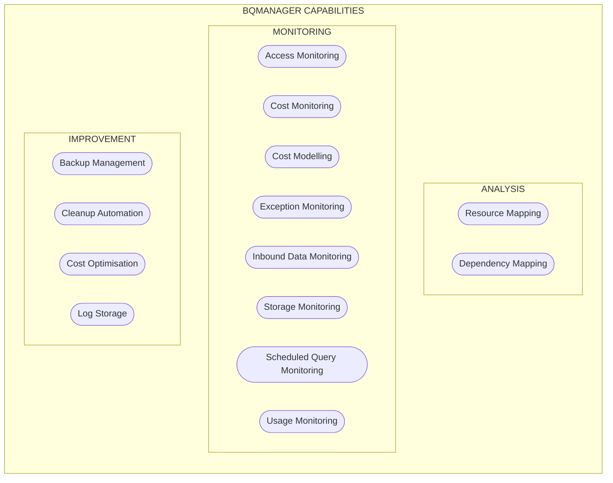

# Objectives
BigQuery Manager has been developed with three core guiding principles: **Visibility**, **Simplicity** and **Efficiency**.  These can also be considered as three stages of implementation and corresponding levels of maturity.

## Visibility
The first step is to map out the resources (tables, views, routines), connections between the resources and activity and premissions relating to each resource.  This is the foundational knowledge upon which subsequent activities are based.  This resource metadata can then be augmented with real-time usage data to give a clear view of all resources and usage across multiple projects and organisations. This stage powers  data capture for granular historical reporting and modelling, as well as the monitoring strategy.

## Simplicity
Any Data Warehouse tends towards chaos without conscious effort to the contrary. The first step in bringing order to the warehouse is simplification: identifying defunct resources, backing them up and deleting them is a good starting point. Standardisation of naming conventions and simplification of logical relationships and permissions is a subsequent, more complex stage to improve the structure of the data warehouse and the logic flowing through it.

## Effiency
Date Warehouse performance and efficiency improvements result in faster speed _and_ reduced cost, which is desirable in all situations.  Improvements in visibility and simplicity will support these lower costs and increased performance, supporting targeted action as well as cost optimisation by modelling the impact of different pricing models on actual usage data.

# Logical Architecture
These objectives are achieved via the following capabilities, enabled by BigQuery `INFORMATION_SCHEMA`views in addition to a custom set of Cloud Functions.

