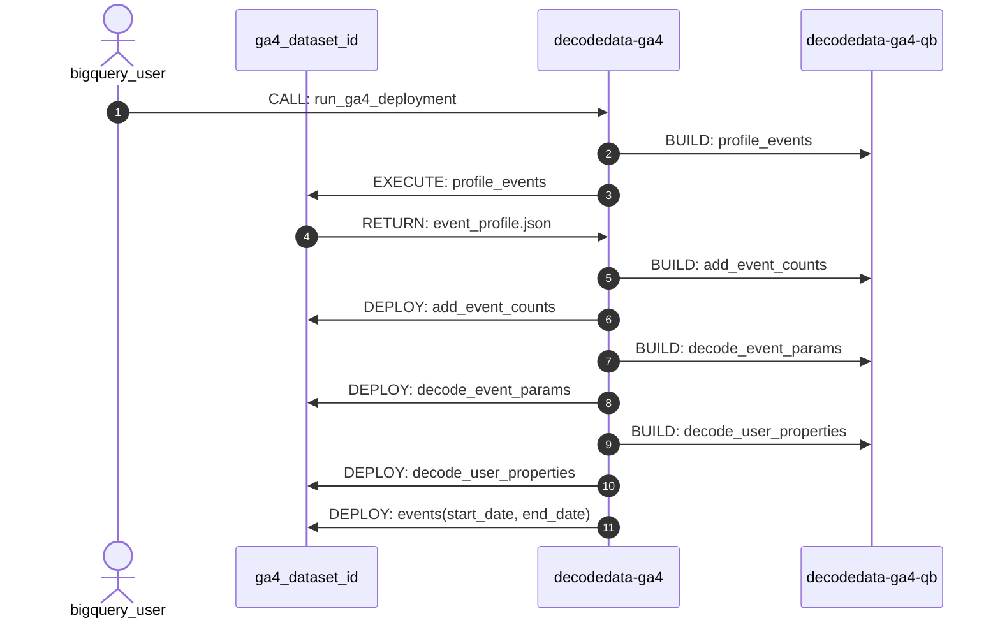

# Functions

## **`deploy_ga4_decoder`**
_**Attribute**_ | Value
--- | ---
_**Name**_ | `deploy_ga4_decoder`
_**ID**_ | `decodedata-ga4.[region].deploy_ga4_decoder`
_**Description**_ | Decoder deployment function for the [Google Analytics 4 BigQuery Export](https://support.google.com/analytics/answer/9358801?hl=en) event data. 
_**Type**_ | `PROCEDURE`
_**Arguments**_ | `ga4_dataset_id STRING, destination_dataset_id STRING, conversion_events ARRAY<STRING>, options JSON`
_**Returns**_ | Creates the date-parameterised table function `[destination_dataset_id].events(start_date DATE, end_date DATE)` based on a custom-generated, editable set of SQL user-defined functions: `add_event_counts`, `decode_event_params` and `decode_user_properties` which are also deployed to the `destination_dataset_id` dataset.
_**Dependencies**_ | `decodedata-ga4-qb`, `bqtools`

!!! info "execution : `deploy_ga4_decoder`"
    The following command will profile the events in the `ga4_dataset_id` dataset and deploy the functions to the same dataset, with no custom conversion events (only the default `purchase` event) and without [`NOT LIKE ANY`](https://cloud.google.com/bigquery/docs/reference/standard-sql/operators#like_operator_quantified) value exclusions from the `event_names`, `event_params` or `user_properties` output structs.

    === "EU"
        ```sql
        CALL `decodedata-ga4.eu.deploy_ga4_decoder`(ga4_dataset_id, ga4_dataset_id, [], TO_JSON(NULL))
        ```

    === "US"
        ```sql
        CALL `decodedata-ga4.us.deploy_ga4_decoder`(ga4_dataset_id, ga4_dataset_id, [], TO_JSON(NULL))
        ```

# Execution Sequence
The `project_id` suffix `-qb` denotes query-builder. This is the code which compiles arguments and logic into SQL code.  This SQL can then be executed or used to create or modify resources. 



Note that there are additional dependencies on the `bqtools` and `bqtools-qb` libraries.