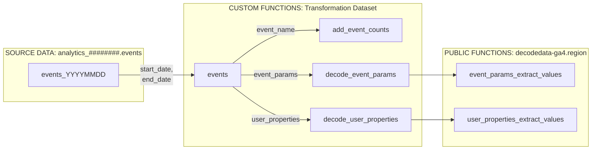

# Summary
In order to transform GA4 event data in BigQuery into a useable structure, 
the complex nested `event_params` and `user_properties` objects need to be decoded, whilst controlling for potential data type inconsistencies.  This means that it is necessary to profile the data and deploy a set of custom functions, unique to each property (or group of properties, if schema alignement and potentially data integration is desired).

## Resource Deployment
The following resources are deployed to either the `ga4_dataset` or a different dataset in the same region:

 Name | Type | Arguments | Description
 --- | --- | --- | ---
`events` | `TABLE FUNCTION` | `start_date DATE`, `end_date DATE` | Main transformation function containing all transformation steps.
`add_event_counts` | `FUNCTION` | `event_name STRING` | Returns an `event_count` `STRUCT` containing `event_name` count columns for each observed `event_name` value, in addition to `total_events` and total observed `conversion` events.
`decode_event_params` | `FUNCTION` |`event_params ARRAY<STRUCT<key STRING, value STRUCT<string_value STRING, int_value INT64, float_value FLOAT64, double_value FLOAT64>>>` | Decoder for `event_params` objects. Returns an `event_param` `STRUCT` containing `event_param` values for each observed `event_name` key with the appropriate data types.
`decode_user_properties` | `FUNCTION` |`user_properties ARRAY<STRUCT<key STRING, value STRUCT<string_value STRING, int_value INT64, float_value FLOAT64, double_value FLOAT64, set_timestamp_micros INT64>>>` | Decoder for `user_properties` objects. Returns a `user_property` `STRUCT` containing `user_properties` values for each observed `user_properties` key with the appropriate data types.

These resource are related according to the following dependency diagram:



Note that custom functions can be deployed to the inbound GA4 dataset, however permissions limitations might mean that deploying them into a separate but regionally co-located dataset is preferable.

## Looker Studio Connection
The `events` `TABLE FUNCTION` can be directly connected to a Looker Studio report, whilst leveraging report date parameters by using the following custom SQL:

```sql
SELECT * 
FROM `[project_id].analytics_########.events`(
PARSE_DATE("%Y%m%d", @DS_START_DATE), 
PARSE_DATE("%Y%m%d", @DS_END_DATE));
```

This is extremely efficient as it will only query the date partitions (and therefore upstream source table shards) which are selected in the report, improving performance and minimising query load and cost.

## Resource Update
Once deployed, resource SQL code can be updated manually via the BigQuery Console (`EDIT PERSISTENT FUNCTION` for `add_event_counts`, `decode_event_params` or `decode_user_properties` and `EDIT TABLE FUNCTION` for `events`).  Any of these functions can also be refreshed at any point by re-running the appropriate deployment function.

One recommended approach is to periodically update the three sub-functions (`add_event_counts`, `decode_event_params`, `decode_user_properties`) to ensure that new values are picked up. Minor updates to the overall logic can then be maintained in the `events` `TABLE FUNCTION`.

## Additional Custom Logic
If there is significant additional downstream logic, another approach is to build one or more additional linked date-parameterised table functions in which you can encapsulate additional logic. The first common table expression (CTE) in this function would then be:

```sql
WITH
get_events AS (
SELECT * 
FROM  `[project_id].dataset_name.events`(start_date DATE, end_date DATE) 
)
...
```

You would then use this table function for report connection or table creation.

## Performance Optimisation
If you are expecting high query load or have a large volume of data, it might be preferable to use the output table function to create a date-partitioned table, and connecting downstream tools to this table.  This might also be required if your downstream reporting tool cannot use custom SQL or report date parameters.

### Full Table Refresh
In the simplest form, this can be actioned and scheduled as a full table refresh using the following example syntax (note that this would be for the last 365 days only, but the data parameters can be changed to any arbitrary `DATE` values):

```sql
CREATE OR REPLACE TABLE
`[project_id].[dataset_name].[destination_table_name]`
PARTITION BY date
AS
SELECT * 
FROM  `[project_id].dataset_name.events`(CURRENT_DATE - 365, CURRENT_DATE) 
```

Note that full table refreshes are inefficient as you will be repeatedly copying the same data, and the query load and cost will scale linearly over time. This may be acceptable for small data sources, but an incremental approach is typically preferable.

### Incremental Refresh
By consistently using date-partitioned tables and table functions and treating table date partitions as immutable objects, an incremental approach is relatively simple to deploy. This will result in lower refresh costs which will only scale with volume increases.

We leverage some of the tools in our `bqtools` library to deploy this in a concise and efficient manner.
