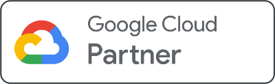

---
hide:
  - navigation
---

{ align=right }

## What we do
We build, manage and license serverless Google Cloud data automation capabilities and products.

## Who we are
Transformationflow is a [Google Cloud Partner](https://cloud.google.com/find-a-partner/partner/transformationflow-%C3%96u), comprising a small, specialist team of Google Cloud Certified [Professional Data Engineers](https://cloud.google.com/learn/certification/data-engineer).

We have been working exclusively with Google Cloud and BigQuery since 2017.

## How we do it
We use [BigQuery](https://cloud.google.com/bigquery) as the foundation for our data automation solutions, in addition to adjacent Google Cloud products such as:

- [Google Cloud Storage](https://cloud.google.com/storage) for file ingestion, storage and backup
- [Pub/Sub](https://cloud.google.com/pubsub) for streaming data and messaging
- [Cloud Functions](https://cloud.google.com/functions) for custom actions and interaction with external APIs (predominantly in Python)
- [Remote Functions](https://cloud.google.com/bigquery/docs/remote-functions) to deploy Cloud Functions in BigQuery workflows
- [Scheduled Queries](https://cloud.google.com/bigquery/docs/scheduling-queries) for automation and function orchestration
- [Looker Studio](https://lookerstudio.google.com/) for end-user and data monitoring dashboards

We have advanced capabilities in the GoogleSQL procedural language, and build custom and reuseable functions, procedures and table functions to solve complex data automation challenges. 

