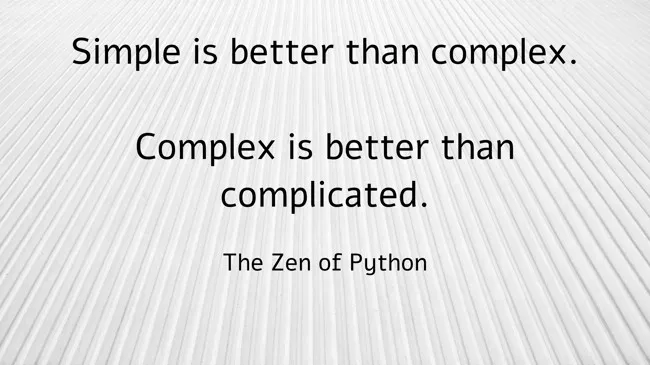

---
hide:
    - navigation
---

-   [:fontawesome-brands-medium:{ .lg .middle }](https://medium.com/decode-data/how-to-build-a-simple-data-stack-on-bigquery-7f63d744b81d){:target="_blank"} June 21, 2024 :material-clock-fast:{ .lg .middle } 11 min read 
    
    # [Understanding the GA4 BigQuery Export Schema and Structure](https://medium.com/towards-data-science/understanding-the-ga4-bigquery-export-schema-and-structure-3a068ebee4ea){:target="_blank"}

    [{ align=center }](https://medium.com/towards-data-science/understanding-the-ga4-bigquery-export-schema-and-structure-3a068ebee4ea){:target="_blank"}
    ---
    
    A qualitative investigation into one of the weirdest data structures ever forced upon millions of innocent, unsuspecting analysts

    [:octicons-arrow-right-24: Continue reading](https://medium.com/towards-data-science/understanding-the-ga4-bigquery-export-schema-and-structure-3a068ebee4ea){:target="_blank"}

-   [:fontawesome-brands-medium:{ .lg .middle }](https://medium.com/decode-data/how-to-build-a-simple-data-stack-on-bigquery-7f63d744b81d){:target="_blank"} June 14, 2024 :material-clock-fast:{ .lg .middle } 17 min read 
    
    # [A Guide to Functional Data Engineering in BigQuery](https://medium.com/decode-data/a-guide-to-functional-data-engineering-in-bigquery-9c0065d76749){:target="_blank"}

    [{ align=center }](https://medium.com/decode-data/a-guide-to-functional-data-engineering-in-bigquery-9c0065d76749){:target="_blank"}
    ---
    
    An exploration of the Functional Data Engineering paradigm and how to implement this in BigQuery

    [:octicons-arrow-right-24: Continue reading](https://medium.com/decode-data/a-guide-to-functional-data-engineering-in-bigquery-9c0065d76749){:target="_blank"}

-   [:fontawesome-brands-medium:{ .lg .middle }](https://medium.com/decode-data/how-to-build-a-simple-data-stack-on-bigquery-7f63d744b81d){:target="_blank"} June 5, 2024 :material-clock-fast:{ .lg .middle } 16 min read 
    
    # [How to Build a Simple Data Stack on BigQuery](https://medium.com/decode-data/how-to-build-a-simple-data-stack-on-bigquery-7f63d744b81d){:target="_blank"}

    [{ align=center }](https://medium.com/decode-data/how-to-build-a-simple-data-stack-on-bigquery-7f63d744b81d){:target="_blank"}
    ---
    
    Building data infrastructure on BigQuery is a highly capable, escalable, extensible, accessible and future-proof choice for any team or organisation, at any scale

    [:octicons-arrow-right-24: Continue reading](https://medium.com/decode-data/how-to-build-a-simple-data-stack-on-bigquery-7f63d744b81d){:target="_blank"}

-   [:fontawesome-brands-medium:{ .lg .middle }](https://medium.com/decode-data/essential-sql-functions-for-the-ga4-bigquery-events-export-adc07bcefc11){:target="_blank"} March 27, 2024 :material-clock-fast:{ .lg .middle } 5 min read 
    
    # [Essential SQL Functions for GA4 BigQuery Export Analysis](https://medium.com/decode-data/essential-sql-functions-for-the-ga4-bigquery-events-export-adc07bcefc11){:target="_blank"}

    [{ align=center }](https://medium.com/decode-data/essential-sql-functions-for-the-ga4-bigquery-events-export-adc07bcefc11){:target="_blank"}
    ---
    
    The fundamental functions you’ll need to master if you want to work with the GA4 events data export in BigQuery

    [:octicons-arrow-right-24: Continue reading](https://medium.com/decode-data/essential-sql-functions-for-the-ga4-bigquery-events-export-adc07bcefc11){:target="_blank"}

-   [:fontawesome-brands-medium:{ .lg .middle }](https://medium.com/towards-data-science/google-pub-sub-to-bigquery-the-simple-way-de116234fb87){:target="_blank"} Sep 21, 2023 :material-clock-fast:{ .lg .middle } 8 min read 
    
    # [Google Pub/Sub to BigQuery the simple way](https://medium.com/towards-data-science/google-pub-sub-to-bigquery-the-simple-way-de116234fb87){:target="_blank"}

    [{ align=center }](https://medium.com/towards-data-science/google-pub-sub-to-bigquery-the-simple-way-de116234fb87){:target="_blank"}

    ---
    
    A hands-on guide to implementing BigQuery Subscriptions in Pub/Sub for simple message and streaming ingestion

    [:octicons-arrow-right-24: Continue reading](https://medium.com/towards-data-science/google-pub-sub-to-bigquery-the-simple-way-de116234fb87){:target="_blank"}

-   [:fontawesome-brands-medium:{ .lg .middle }](https://towardsdatascience.com/getting-started-with-bigquery-sql-user-defined-functions-sql-udfs-a99c79689d4b){:target="_blank"} May 25, 2022  :material-clock-fast:{ .lg .middle } 5 min read 
    
    # [Getting Started with BigQuery SQL User Defined Functions (SQL UDFs)](https://towardsdatascience.com/getting-started-with-bigquery-sql-user-defined-functions-sql-udfs-a99c79689d4b){:target="_blank"}

    [.jpg){ align=center }](https://towardsdatascience.com/getting-started-with-bigquery-sql-user-defined-functions-sql-udfs-a99c79689d4b){:target="_blank"}

    ---
    
    A powerful and fundamental building block which enables custom extension of the core BigQuery platform functionality

    [:octicons-arrow-right-24: Continue reading](https://towardsdatascience.com/getting-started-with-bigquery-sql-user-defined-functions-sql-udfs-a99c79689d4b){:target="_blank"}

-   [:fontawesome-brands-medium:{ .lg .middle }](https://towardsdatascience.com/google-cloud-storage-gcs-to-bigquery-the-simple-way-4bb74216b8c8){:target="_blank"} Apr 22, 2021  :material-clock-fast:{ .lg .middle } 6 min read 
    
    # [Google Cloud Storage (GCS) to BigQuery the simple way](https://towardsdatascience.com/google-cloud-storage-gcs-to-bigquery-the-simple-way-4bb74216b8c8){:target="_blank"}

    [_to_BigQuery_the_simple_way.jpg){ align=center }](https://towardsdatascience.com/google-cloud-storage-gcs-to-bigquery-the-simple-way-4bb74216b8c8){:target="_blank"}

    ---
    
    Because simple is better than complex (but complex is better than complicated)

    [:octicons-arrow-right-24: Continue reading](https://towardsdatascience.com/google-cloud-storage-gcs-to-bigquery-the-simple-way-4bb74216b8c8){:target="_blank"}

-   [:fontawesome-brands-medium:{ .lg .middle }](https://towardsdatascience.com/how-to-build-a-unique-md5-row-hash-using-sql-in-bigquery-plus-a-few-related-things-e6f71820f38b){:target="_blank"} Aug 5, 2022  :material-clock-fast:{ .lg .middle } 9 min read 
    
    # [How to Build a Unique MD5 Row Hash Using SQL in BigQuery (Plus a Few Related Things)](https://towardsdatascience.com/how-to-build-a-unique-md5-row-hash-using-sql-in-bigquery-plus-a-few-related-things-e6f71820f38b){:target="_blank"}

    [.jpg){ align=center }](https://towardsdatascience.com/how-to-build-a-unique-md5-row-hash-using-sql-in-bigquery-plus-a-few-related-things-e6f71820f38b){:target="_blank"}

    ---
    
    Using native BigQuery functionality to generate a dynamic, unique row identifier in SQL

    [:octicons-arrow-right-24: Continue reading](https://towardsdatascience.com/how-to-build-a-unique-md5-row-hash-using-sql-in-bigquery-plus-a-few-related-things-e6f71820f38b){:target="_blank"}

-   [:fontawesome-brands-medium:{ .lg .middle }](https://towardsdatascience.com/plotting-bar-charts-in-bigquery-using-a-sql-user-defined-function-udf-ca6056aac680){:target="_blank"} Mar 15, 2022  :material-clock-fast:{ .lg .middle } 9 min read 
    
    # [Plotting Bar Charts in BigQuery Using a SQL User Defined Function (UDF)](https://towardsdatascience.com/plotting-bar-charts-in-bigquery-using-a-sql-user-defined-function-udf-ca6056aac680){:target="_blank"}

    [.jpg){ align=center }](https://towardsdatascience.com/plotting-bar-charts-in-bigquery-using-a-sql-user-defined-function-udf-ca6056aac680){:target="_blank"}

    ---
    
    Minimise context switching and make your workflow faster

    [:octicons-arrow-right-24: Continue reading](https://towardsdatascience.com/plotting-bar-charts-in-bigquery-using-a-sql-user-defined-function-udf-ca6056aac680){:target="_blank"}

-   [:fontawesome-brands-medium:{ .lg .middle }](https://towardsdatascience.com/sql-string-templating-in-bigquery-four-methods-6884764d1ee9){:target="_blank"} Jan 3, 2022  :material-clock-fast:{ .lg .middle } 7 min read 
    
    # [SQL String Templating in BigQuery Scripts: Four Methods](https://towardsdatascience.com/sql-string-templating-in-bigquery-four-methods-6884764d1ee9){:target="_blank"}

    [{ align=center }](https://towardsdatascience.com/sql-string-templating-in-bigquery-four-methods-6884764d1ee9){:target="_blank"}

    ---
    
    Powerful foundational techniques to help unlock the power of BigQuery scripting and automation

    [:octicons-arrow-right-24: Continue reading](https://towardsdatascience.com/sql-string-templating-in-bigquery-four-methods-6884764d1ee9){:target="_blank"}

-   [:fontawesome-brands-medium:{ .lg .middle }](https://towardsdatascience.com/getting-started-with-bigquery-scripting-45bdd968010c){:target="_blank"} Nov 10, 2021  :material-clock-fast:{ .lg .middle } 4 min read 
    
    # [Getting Started with BigQuery Scripting](https://towardsdatascience.com/getting-started-with-bigquery-scripting-45bdd968010c){:target="_blank"}

    [{ align=center }](https://towardsdatascience.com/getting-started-with-bigquery-scripting-45bdd968010c){:target="_blank"}

    ---
    
    Demystifying this powerful but potentially difficult to grasp aspect of BigQuery functionality, one simple step at a time

    [:octicons-arrow-right-24: Continue reading](https://towardsdatascience.com/getting-started-with-bigquery-scripting-45bdd968010c){:target="_blank"}

    
-   [:fontawesome-brands-medium:{ .lg .middle }](https://blog.devgenius.io/connecting-bigquery-to-colab-and-converting-query-results-to-python-dictionaries-9a19a4bac065){:target="_blank"} Apr 27, 2021  :material-clock-fast:{ .lg .middle } 3 min read 
    
    # [Connecting BigQuery to Colab and Converting Query Results to Python Dictionaries](https://blog.devgenius.io/connecting-bigquery-to-colab-and-converting-query-results-to-python-dictionaries-9a19a4bac065){:target="_blank"}

    [{ align=center }](https://blog.devgenius.io/connecting-bigquery-to-colab-and-converting-query-results-to-python-dictionaries-9a19a4bac065){:target="_blank"}

    ---
    
    A simple method for working with BigQuery results in Python (for pandaphobes)

    [:octicons-arrow-right-24: Continue reading](https://blog.devgenius.io/connecting-bigquery-to-colab-and-converting-query-results-to-python-dictionaries-9a19a4bac065){:target="_blank"}

